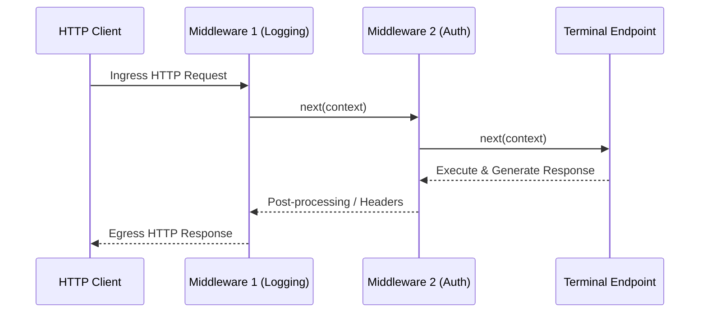

# Modern ASP.NET Core & .NET Enterprise Architecture Masterclass (.NET 8 & .NET 9)

[](https://dotnet.microsoft.com/)
[](https://learn.microsoft.com/en-us/aspnet/core/)
[-0078D4.svg)](https://learn.microsoft.com/en-us/aspnet/core/fundamentals/servers/kestrel)
[](#stage-1-the-modern-aspnet-core-hosting-pipeline--kestrel-architecture)
[](https://learn.microsoft.com/en-us/ef/core/)
[](LICENSE)

> A production-grade, architectural masterclass on building high-performance, resilient distributed web APIs, event-driven backends, and microservices using ASP.NET Core (.NET 8 and .NET 9). Tailored for backend system architects, platform engineers, and enterprise developers building low-latency, zero-downtime services.

---

## Executive Summary & System Topology

ASP.NET Core in .NET 8 and .NET 9 represents one of the fastest, most scalable web frameworks in industry benchmarks (frequently ranking among the top 10 frameworks on the TechEmpower benchmark suite). It provides a unified, cross-platform runtime for RESTful APIs, gRPC services, GraphQL endpoints, real-time WebSockets, and background message consumers.

Enterprise systems built on ASP.NET Core adhere to four core architectural pillars:

1. **Ultra-Low Latency Edge Processing with Kestrel**: Kestrel is an event-driven, asynchronous I/O server powered by native Linux `epoll`, macOS `kqueue`, and Windows `IOCP`. It natively supports HTTP/1.1, HTTP/2 multiplexing, and HTTP/3 over QUIC with TLS 1.3 resumption.
2. **Deterministic Middleware Pipeline**: Every incoming HTTP request flows through a bidirectional, composable pipeline constructed via functional delegates (`RequestDelegate`). This architecture supports early circuit-breaking, zero-alloc routing, endpoint filtering, rate limiting, and automated distributed tracing.
3. **High-Performance Inversion of Control**: The built-in Microsoft dependency injection container (`Microsoft.Extensions.DependencyInjection`) provides native support for Transient, Scoped, and Singleton lifetimes, along with .NET 8 Keyed Services and automatic captive dependency validation in development environments.
4. **Resilience & Fault Tolerance by Default**: Integration with `Polly v8` and `Microsoft.Extensions.Resilience` enables declarative, non-blocking resilience pipelines featuring circuit breakers, rate limiters, retries with jitter, hedging, and timeout policies.

```
+---------------------------------------------------------------------------------------------------+
|                                  ASP.NET CORE REQUEST PIPELINE                                    |
+---------------------------------------------------------------------------------------------------+
|  Client (Browser / Mobile / Microservice)                                                         |
|        |                                                                                          |
|        v  HTTPS / HTTP/2 / HTTP/3 (QUIC)                                                          |
|  [ Kestrel Web Server ] (Connection Sockets / Transport Layer / TLS 1.3 Termination)              |
|        |                                                                                          |
|        v  HttpContext (HttpRequest, HttpResponse, ClaimsPrincipal, CancellationToken)            |
|  +---------------------------------------------------------------------------------------------+  |
|  |                              BIDIRECTIONAL MIDDLEWARE PIPELINE                              |  |
|  |  [ ExceptionHandler / Diagnostic Logging / OpenTelemetry TraceContext ]                    |  |
|  |        v                                                                                    |  |
|  |  [ HSTS / HTTPS Redirection / CORS Policy ]                                                 |  |
|  |        v                                                                                    |  |
|  |  [ Rate Limiting Middleware (Token Bucket / Sliding Window) ]                              |  |
|  |        v                                                                                    |  |
|  |  [ Routing Middleware (`UseRouting`) - Matches URL Pattern to EndpointMetadata ]           |  |
|  |        v                                                                                    |  |
|  |  [ Authentication (`UseAuthentication`) - Validates JWT / Bearer / Cookies ]                |  |
|  |        v                                                                                    |  |
|  |  [ Authorization (`UseAuthorization`) - Enforces Policies / Roles / Claims ]                |  |
|  |        v                                                                                    |  |
|  |  [ Endpoint Execution (`UseEndpoints`) - Minimal API RouteHandler / Controller Action ]    |  |
|  +---------------------------------------------------------------------------------------------+  |
|        |                                                                                          |
|        v                                                                                          |
|  [ Endpoint Filters / Model Binding / Validation ] ---> [ Application Domain & EF Core ]         |
+---------------------------------------------------------------------------------------------------+
```

---

## Architectural Comparison Matrix

| Architectural Feature | ASP.NET Core (.NET 8/9) | Node.js (Fastify / NestJS) | Java (Spring Boot 3) | Go (Gin / Chi) | Python (FastAPI) |
| :--- | :--- | :--- | :--- | :--- | :--- |
| **I/O Engine** | Kestrel (Socket Transport, IOCP/epoll) | Node.js libuv event loop | Netty / Tomcat (Virtual Threads) | Go runtime netpoller | Asyncio (uvloop) |
| **HTTP/3 QUIC Support** | First-class native in Kestrel | Experimental / External reverse proxy | Requires external proxy or Netty incubator | Native via `quic-go` | External reverse proxy (Nginx/Caddy) |
| **API Paradigm** | Minimal APIs & Controller MVC | Decorators / Express routes | `@RestController` Annotations | Flat route handlers | Pydantic + route decorators |
| **Dependency Injection** | High-perf compiled DI built-in | NestJS reflection DI | Spring IoC container (heavy reflection) | Manual struct wiring / Wire | FastAPI `Depends()` |
| **ORM & Data Access** | EF Core 8/9 + Dapper | Prisma / TypeORM | Spring Data JPA / Hibernate | GORM / sqlx | SQLAlchemy / Tortoise |
| **Real-Time Engine** | SignalR (WebSockets, SSE, MsgPack) | Socket.io / ws | Spring WebSocket / STOMP | Gorilla / melody | WebSockets / Channels |
| **Resilience Engine** | Polly v8 (Zero-alloc pipelines) | Baresoil / opossum | Resilience4j | Custom retry wrappers | Tenacity |
| **Native AOT Footprint** | Supported (< 30MB Docker image) | N/A (Interpreted V8 runtime) | GraalVM Native Image | Native binary (~15MB) | N/A |

---

## Table of Contents

1. [Stage 1: The Modern ASP.NET Core Hosting Pipeline & Kestrel Architecture](#stage-1-the-modern-aspnet-core-hosting-pipeline--kestrel-architecture)
2. [Stage 2: Middleware Pipeline Architecture, Request Lifecycle & Error Handling](#stage-2-middleware-pipeline-architecture-request-lifecycle--error-handling)
3. [Stage 3: Dependency Injection Container Internals, Lifetimes & Keyed Services](#stage-3-dependency-injection-container-internals-lifetimes--keyed-services)
4. [Stage 4: High-Performance Minimal APIs, Route Handlers & Endpoint Filters](#stage-4-high-performance-minimal-apis-route-handlers--endpoint-filters)
5. [Stage 5: Enterprise Data Access with Entity Framework Core 8/9](#stage-5-enterprise-data-access-with-entity-framework-core-89)
6. [Stage 6: Identity, JWT Authentication & Policy-Based Authorization](#stage-6-identity-jwt-authentication--policy-based-authorization)
7. [Stage 7: Real-Time Systems with SignalR & Background Hosted Services](#stage-7-real-time-systems-with-signalr--background-hosted-services)
8. [Stage 8: Distributed Caching, HybridCache & Polly v8 Resilience](#stage-8-distributed-caching-hybridcache--polly-v8-resilience)
9. [Stage 9: Enterprise Microservices with gRPC & Protocol Buffers](#stage-9-enterprise-microservices-with-grpc--protocol-buffers)
10. [Stage 10: Production Observability, OpenTelemetry, Metrics & Health Checks](#stage-10-production-observability-opentelemetry-metrics--health-checks)
11. [Production Blueprint: Enterprise Resilient Order Management Microservice](#production-blueprint-enterprise-resilient-order-management-microservice)
12. [Anti-Patterns & Systems Pitfalls](#anti-patterns--systems-pitfalls)
13. [Architectural Systems Interview Q&A](#architectural-systems-interview-qa)
14. [Modern ASP.NET Core CLI & Configuration Cheat Sheet](#modern-aspnet-core-cli--configuration-cheat-sheet)

---

## Stage 1: The Modern ASP.NET Core Hosting Pipeline & Kestrel Architecture

### 1.1 `WebApplicationBuilder` and Unified Host Architecture

Prior to .NET 6, ASP.NET Core applications were bifurcated into `Program.cs` and `Startup.cs` (`ConfigureServices` and `Configure`). Modern ASP.NET Core consolidates initialization into `WebApplication.CreateBuilder(args)`:

```csharp
using Microsoft.AspNetCore.Builder;
using Microsoft.Extensions.DependencyInjection;
using Microsoft.Extensions.Hosting;

var builder = WebApplication.CreateBuilder(args);

// 1. Configure Kestrel socket limits and HTTP/3 support
builder.WebHost.ConfigureKestrel(serverOptions =>
{
    serverOptions.Limits.MaxConcurrentConnections = 10_000;
    serverOptions.Limits.MaxRequestBodySize = 10 * 1024 * 1024; // 10MB
    serverOptions.Limits.KeepAliveTimeout = TimeSpan.FromMinutes(2);
    serverOptions.Limits.RequestHeadersTimeout = TimeSpan.FromSeconds(15);
});

// 2. Add container services
builder.Services.AddEndpointsApiExplorer();
builder.Services.AddSwaggerGen();

var app = builder.Build();

// 3. Configure HTTP request pipeline
if (app.Environment.IsDevelopment())
{
    app.UseSwagger();
    app.UseSwaggerUI();
}

app.UseHttpsRedirection();
app.MapGet("/health", () => Results.Ok(new { status = "Healthy", timestamp = DateTime.UtcNow }));

app.Run();
```

### 1.2 Kestrel Socket Transport & HTTP/3 QUIC

Kestrel uses memory-pooled socket abstractions (`System.IO.Pipelines`) to parse HTTP frames directly into pinned memory slices, avoiding buffer copies between the operating system socket layer and application code:

```csharp
builder.WebHost.ConfigureKestrel(options =>
{
    // Listen on port 5001 for HTTP/1, HTTP/2, and HTTP/3 (QUIC requires TLS)
    options.ListenAnyIP(5001, listenOptions =>
    {
        listenOptions.Protocols = Microsoft.AspNetCore.Server.Kestrel.Core.HttpProtocols.Http1AndHttp2AndHttp3;
        listenOptions.UseHttps();
    });
});
```

---

## Stage 2: Middleware Pipeline Architecture, Request Lifecycle & Error Handling

### 2.1 The Bidirectional Delegate Chain (`RequestDelegate`)

Every middleware component is represented by a `RequestDelegate`:
```csharp
public delegate Task RequestDelegate(HttpContext context);
```
Middleware functions as an onion layer: an incoming request travels through middleware layers in order of declaration until a terminal middleware generates the response, after which execution unwinds back up the chain.



### 2.2 Writing Custom High-Performance Middleware

Standard convention-based middleware requires class instantiations or reflection. High-performance middleware leverages `IMiddleware` (factory-activated) or inline delegates:

```csharp
using System.Diagnostics;
using Microsoft.AspNetCore.Http;
using Microsoft.Extensions.Logging;

public class PerformanceMetricsMiddleware : IMiddleware
{
    private readonly ILogger<PerformanceMetricsMiddleware> _logger;

    public PerformanceMetricsMiddleware(ILogger<PerformanceMetricsMiddleware> logger)
    {
        _logger = logger;
    }

    public async Task InvokeAsync(HttpContext context, RequestDelegate next)
    {
        long startTimestamp = Stopwatch.GetTimestamp();

        // Add correlation ID header to response
        string correlationId = context.Request.Headers["X-Correlation-ID"].FirstOrDefault() 
                               ?? Guid.NewGuid().ToString("N");
        context.Response.Headers.Append("X-Correlation-ID", correlationId);

        try
        {
            await next(context);
        }
        finally
        {
            TimeSpan duration = Stopwatch.GetElapsedTime(startTimestamp);
            _logger.LogInformation("HTTP {Method} {Path} responded {StatusCode} in {DurationMs:0.00}ms [Trace: {CorrelationId}]",
                context.Request.Method,
                context.Request.Path,
                context.Response.StatusCode,
                duration.TotalMilliseconds,
                correlationId);
        }
    }
}
```

### 2.3 .NET 8 Global Exception Handling (`IExceptionHandler`)

Prior to .NET 8, handling unhandled exceptions required custom middleware with try/catch blocks. .NET 8 introduced the `IExceptionHandler` interface and Problem Details (RFC 7807):

```csharp
using System;
using Microsoft.AspNetCore.Diagnostics;
using Microsoft.AspNetCore.Http;
using Microsoft.AspNetCore.Mvc;
using Microsoft.Extensions.Logging;

public class GlobalExceptionHandler(ILogger<GlobalExceptionHandler> logger) : IExceptionHandler
{
    public async ValueTask<bool> TryHandleAsync(
        HttpContext httpContext, 
        Exception exception, 
        CancellationToken cancellationToken)
    {
        logger.LogError(exception, "Unhandled system exception occurred: {Message}", exception.Message);

        var problemDetails = new ProblemDetails
        {
            Status = exception switch
            {
                ArgumentException or InvalidOperationException => StatusCodes.Status400BadRequest,
                KeyNotFoundException => StatusCodes.Status404NotFound,
                UnauthorizedAccessException => StatusCodes.Status401Unauthorized,
                _ => StatusCodes.Status500InternalServerError
            },
            Title = "An error occurred while processing your request",
            Detail = exception.Message,
            Instance = httpContext.Request.Path
        };

        httpContext.Response.StatusCode = problemDetails.Status.Value;
        httpContext.Response.ContentType = "application/problem+json";

        await httpContext.Response.WriteAsJsonAsync(problemDetails, cancellationToken);
        return true; // Mark as handled
    }
}

// In Program.cs
builder.Services.AddExceptionHandler<GlobalExceptionHandler>();
builder.Services.AddProblemDetails();

var app = builder.Build();
app.UseExceptionHandler();
```

---

## Stage 3: Dependency Injection Container Internals, Lifetimes & Keyed Services

### 3.1 Service Lifetimes & The Captive Dependency Anti-Pattern

1. **Transient (`AddTransient`)**: Created each time they are requested. Ideal for lightweight, stateless utility operations.
2. **Scoped (`AddScoped`)**: Created once per HTTP request scope. Required for database contexts (`DbContext`) and unit-of-work repositories.
3. **Singleton (`AddSingleton`)**: Created on initial resolution and persists across the entire application process lifetime.

> [!CAUTION]
> **The Captive Dependency Pitfall**: Injecting a `Scoped` service (like `DbContext`) into a `Singleton` service locks the scoped instance for the lifetime of the application. This causes stale cache corruption, thread-safety violations, and multi-gigabyte memory leaks. ASP.NET Core detects captive dependencies during startup in the `Development` environment by default.

### 3.2 Resolving Scoped Services in Singletons via `IServiceScopeFactory`

When background singleton services need to access scoped database contexts, they must instantiate explicit scopes:

```csharp
using Microsoft.Extensions.DependencyInjection;
using Microsoft.Extensions.Hosting;

public class OrderBackgroundWorker(IServiceScopeFactory scopeFactory) : BackgroundService
{
    protected override async Task ExecuteAsync(CancellationToken stoppingToken)
    {
        while (!stoppingToken.IsCancellationRequested)
        {
            // Explicitly create a new scope for the iteration
            using (var scope = scopeFactory.CreateScope())
            {
                var db = scope.ServiceProvider.GetRequiredService<OrderDbContext>();
                var pendingOrders = await db.Orders.Where(o => o.Status == "PENDING").ToListAsync(stoppingToken);
                // Process orders...
            }

            await Task.Delay(TimeSpan.FromSeconds(10), stoppingToken);
        }
    }
}
```

### 3.3 .NET 8 Keyed Services

Prior to .NET 8, registering multiple implementations of an interface required custom factory resolvers. .NET 8 introduced native **Keyed Services**:

```csharp
using Microsoft.Extensions.DependencyInjection;

public interface INotificationProvider
{
    Task SendAsync(string recipient, string message);
}

public class TwilioSmsProvider : INotificationProvider
{
    public Task SendAsync(string recipient, string message) => Task.CompletedTask;
}

public class SendGridEmailProvider : INotificationProvider
{
    public Task SendAsync(string recipient, string message) => Task.CompletedTask;
}

// Registration in Program.cs
builder.Services.AddKeyedSingleton<INotificationProvider, TwilioSmsProvider>("sms");
builder.Services.AddKeyedSingleton<INotificationProvider, SendGridEmailProvider>("email");

// Injection in Endpoint or Service
app.MapPost("/notify/{channel}", async (
    string channel, 
    string target, 
    string msg,
    [FromKeyedServices("sms")] INotificationProvider smsService,
    [FromKeyedServices("email")] INotificationProvider emailService) =>
{
    if (channel == "sms") await smsService.SendAsync(target, msg);
    else await emailService.SendAsync(target, msg);
    return Results.Accepted();
});
```

---

## Stage 4: High-Performance Minimal APIs, Route Handlers & Endpoint Filters

### 4.1 Minimal APIs vs Traditional Controllers

Traditional MVC Controllers require reflection, action filter pipelines, model binders, and heavy object allocations. Minimal APIs compile routes directly to `RequestDelegate` instances using Roslyn code generators, achieving near-native throughput:

```csharp
using Microsoft.AspNetCore.Http;
using System.ComponentModel.DataAnnotations;

public record CreateProductRequest(
    [Required][StringLength(100)] string Name,
    [Range(0.01, 100000.0)] decimal Price
);

public record ProductResponse(Guid Id, string Name, decimal Price, DateTime CreatedAt);

// Grouping and Versioning Endpoints
var productsApi = app.MapGroup("/api/v1/products")
                     .WithTags("Products")
                     .RequireRateLimiting("fixed-window");

productsApi.MapPost("/", async (CreateProductRequest request, IProductRepository repo) =>
{
    var product = new Product(Guid.NewGuid(), request.Name, request.Price, DateTime.UtcNow);
    await repo.SaveAsync(product);
    return Results.Created($"/api/v1/products/{product.Id}", product);
})
.WithName("CreateProduct")
.Produces<ProductResponse>(StatusCodes.Status201Created)
.ProducesValidationProblem();
```

### 4.2 Endpoint Filters (`IEndpointFilter`)

Endpoint filters provide cross-cutting concerns (validation, authorization, logging) scoped to individual Minimal API route handlers:

```csharp
public class ValidationFilter<T> : IEndpointFilter where T : class
{
    public async ValueTask<object?> InvokeAsync(EndpointFilterInvocationContext context, EndpointFilterDelegate next)
    {
        var argument = context.Arguments.OfType<T>().FirstOrDefault();
        if (argument is null)
        {
            return Results.BadRequest("Missing required request payload.");
        }

        var validationContext = new ValidationContext(argument);
        var validationResults = new List<ValidationResult>();

        if (!Validator.TryValidateObject(argument, validationContext, validationResults, true))
        {
            var errors = validationResults.ToDictionary(
                r => r.MemberNames.FirstOrDefault() ?? "Error",
                r => new[] { r.ErrorMessage ?? "Validation failure" }
            );
            return Results.ValidationProblem(errors);
        }

        return await next(context);
    }
}

// Attached directly to route
productsApi.MapPost("/", HandleCreateProduct)
           .AddEndpointFilter<ValidationFilter<CreateProductRequest>>();
```

### 4.3 Custom Route Binding via `BindAsync` and `TryParse`

Minimal APIs allow types to define their own zero-allocation parameter parsing contracts without custom model binders:

```csharp
public readonly struct PagingParameters
{
    public int PageNumber { get; init; }
    public int PageSize { get; init; }

    public static async ValueTask<PagingParameters> BindAsync(HttpContext context)
    {
        int page = int.TryParse(context.Request.Query["page"], out int p) ? Math.Max(1, p) : 1;
        int size = int.TryParse(context.Request.Query["size"], out int s) ? Math.Clamp(s, 1, 100) : 20;

        return new PagingParameters { PageNumber = page, PageSize = size };
    }
}

app.MapGet("/api/items", (PagingParameters paging) => Results.Ok(paging));
```

---

## Stage 5: Enterprise Data Access with Entity Framework Core 8/9

### 5.1 DbContext Pooling (`AddDbContextPool`)

Instantiating a `DbContext` per HTTP request incurs allocation overhead (initializing internal services, query caches, and state managers). `AddDbContextPool` pools `DbContext` instances similar to a database connection pool:

```csharp
builder.Services.AddDbContextPool<ApplicationDbContext>(options =>
{
    options.UseNpgsql(builder.Configuration.GetConnectionString("PostgresDb"), npgsqlOptions =>
    {
        npgsqlOptions.EnableRetryOnFailure(maxRetryCount: 3, maxRetryDelay: TimeSpan.FromSeconds(5), errorCodesToAdd: null);
        npgsqlOptions.UseQuerySplittingBehavior(QuerySplittingBehavior.SplitQuery);
    });
    
    // Disable tracking for read-only microservices
    options.UseQueryTrackingBehavior(QueryTrackingBehavior.NoTracking);
}, poolSize: 1024);
```

### 5.2 Compiled Queries & High-Throughput Reads

For latency-critical endpoints, compiling LINQ expressions once eliminates LINQ-to-SQL translation overhead on subsequent executions:

```csharp
using Microsoft.EntityFrameworkCore;

public class CompiledQueries
{
    public static readonly Func<ApplicationDbContext, Guid, Task<Product?>> GetProductByIdAsync =
        EF.CompileAsyncQuery((ApplicationDbContext ctx, Guid id) =>
            ctx.Products.AsNoTracking().FirstOrDefault(p => p.Id == id));
}
```

### 5.3 Optimistic Concurrency Control

Preventing lost updates in distributed systems without pessimistic database row locking:

```csharp
public class OrderEntity
{
    public Guid Id { get; set; }
    public decimal TotalAmount { get; set; }
    public string Status { get; set; } = "PENDING";

    [Timestamp]
    public byte[] RowVersion { get; set; } = null!;
}

// Handling concurrent update conflict in endpoint
try
{
    await dbContext.SaveChangesAsync();
}
catch (DbUpdateConcurrencyException ex)
{
    // Inform client that the record has been modified by another request
    return Results.Conflict("The record was modified concurrently. Please reload.");
}
```

---

## Stage 6: Identity, JWT Authentication & Policy-Based Authorization

### 6.1 Securing Web APIs with JWT Bearer Authentication

```csharp
using Microsoft.AspNetCore.Authentication.JwtBearer;
using Microsoft.IdentityModel.Tokens;
using System.Text;

builder.Services.AddAuthentication(JwtBearerDefaults.AuthenticationScheme)
    .AddJwtBearer(options =>
    {
        options.TokenValidationParameters = new TokenValidationParameters
        {
            ValidateIssuer = true,
            ValidateAudience = true,
            ValidateLifetime = true,
            ValidateIssuerSigningKey = true,
            ValidIssuer = builder.Configuration["Jwt:Issuer"],
            ValidAudience = builder.Configuration["Jwt:Audience"],
            IssuerSigningKey = new SymmetricSecurityKey(
                Encoding.UTF8.GetBytes(builder.Configuration["Jwt:SecretKey"]!)),
            ClockSkew = TimeSpan.FromSeconds(30)
        };
    });

builder.Services.AddAuthorization(options =>
{
    options.AddPolicy("RequireAdminTier", policy =>
        policy.RequireRole("PlatformAdmin").RequireClaim("security_clearance", "Level3"));
});
```

### 6.2 Custom Policy Authorization Handlers

```csharp
using Microsoft.AspNetCore.Authorization;

public record MinimumAgeRequirement(int MinimumAge) : IAuthorizationRequirement;

public class MinimumAgeHandler : AuthorizationHandler<MinimumAgeRequirement>
{
    protected override Task HandleRequirementAsync(
        AuthorizationHandlerContext context, 
        MinimumAgeRequirement requirement)
    {
        var dobClaim = context.User.FindFirst(c => c.Type == "date_of_birth");
        if (dobClaim != null && DateTime.TryParse(dobClaim.Value, out DateTime dob))
        {
            int age = DateTime.Today.Year - dob.Year;
            if (dob.Date > DateTime.Today.AddYears(-age)) age--;

            if (age >= requirement.MinimumAge)
            {
                context.Succeed(requirement);
            }
        }

        return Task.CompletedTask;
    }
}
```

---

## Stage 7: Real-Time Systems with SignalR & Background Hosted Services

### 7.1 Scalable Real-Time Push with SignalR and Redis Backplane

SignalR abstracts transport protocols (WebSockets, Server-Sent Events, Long Polling). In multi-node Kubernetes clusters, a Redis backplane broadcasts hub messages across all instances:

```csharp
using Microsoft.AspNetCore.SignalR;

public class OrderTrackingHub : Hub
{
    public async Task JoinOrderGroup(string orderId)
    {
        await Groups.AddToGroupAsync(Context.ConnectionId, $"order-{orderId}");
    }

    public async Task LeaveOrderGroup(string orderId)
    {
        await Groups.RemoveFromGroupAsync(Context.ConnectionId, $"order-{orderId}");
    }
}

// Redis Backplane Registration
builder.Services.AddSignalR(options =>
{
    options.EnableDetailedErrors = false;
    options.KeepAliveInterval = TimeSpan.FromSeconds(15);
})
.AddStackExchangeRedis(builder.Configuration.GetConnectionString("Redis")!);
```

### 7.2 Periodic Background Services (`BackgroundService`)

```csharp
using Microsoft.Extensions.Hosting;
using Microsoft.Extensions.Logging;

public class HeartbeatHealthMonitor(ILogger<HeartbeatHealthMonitor> logger) : BackgroundService
{
    protected override async Task ExecuteAsync(CancellationToken stoppingToken)
    {
        using PeriodicTimer timer = new(TimeSpan.FromSeconds(30));

        while (!stoppingToken.IsCancellationRequested && await timer.WaitForNextTickAsync(stoppingToken))
        {
            logger.LogInformation("Background health check heartbeat executed at {Time}", DateTimeOffset.UtcNow);
        }
    }
}
```

---

## Stage 8: Distributed Caching, HybridCache & Polly v8 Resilience

### 8.1 The New .NET 9 `HybridCache`

.NET 9 introduced `HybridCache`, bridging in-memory `IMemoryCache` (L1) and distributed Redis `IDistributedCache` (L2). It automatically prevents **Cache Stampede** via integrated locking:

```csharp
// Program.cs
builder.Services.AddHybridCache(options =>
{
    options.DefaultEntryOptions = new Microsoft.Extensions.Caching.Hybrid.HybridCacheEntryOptions
    {
        Expiration = TimeSpan.FromMinutes(10),
        LocalCacheExpiration = TimeSpan.FromMinutes(2)
    };
});

// Endpoint resolution with automatic stampede prevention
app.MapGet("/api/catalog/{id}", async (string id, HybridCache cache, ICatalogDb db) =>
{
    return await cache.GetOrCreateAsync(
        $"catalog-item-{id}",
        async cancelToken => await db.FetchItemAsync(id, cancelToken)
    );
});
```

### 8.2 Polly v8 Resilience Pipelines

Modern resilience in .NET 8 utilizes declarative resilience pipelines:

```csharp
using Polly;
using Polly.Retry;
using Polly.CircuitBreaker;

var resiliencePipeline = new ResiliencePipelineBuilder<HttpResponseMessage>()
    .AddRetry(new RetryStrategyOptions<HttpResponseMessage>
    {
        MaxRetryAttempts = 3,
        Delay = TimeSpan.FromMilliseconds(200),
        BackoffType = DelayBackoffType.Exponential,
        UseJitter = true
    })
    .AddCircuitBreaker(new CircuitBreakerStrategyOptions<HttpResponseMessage>
    {
        FailureRatio = 0.5,
        SamplingDuration = TimeSpan.FromSeconds(10),
        MinimumThroughput = 8,
        BreakDuration = TimeSpan.FromSeconds(30)
    })
    .AddTimeout(TimeSpan.FromSeconds(2))
    .Build();
```

---

## Stage 9: Enterprise Microservices with gRPC & Protocol Buffers

### 9.1 gRPC High-Throughput Service Implementation

gRPC uses HTTP/2 streams and compact binary Protocol Buffers serialization, reducing network bandwidth by 60% compared to JSON REST APIs:

```protobuf
syntax = "proto3";

option csharp_namespace = "Enterprise.Ordering.Grpc";

service OrderStreamService {
  rpc StreamOrderUpdates (OrderSubscriptionRequest) returns (stream OrderStatusMessage);
}

message OrderSubscriptionRequest {
  string customer_id = 1;
}

message OrderStatusMessage {
  string order_id = 1;
  string status = 2;
  double total_amount = 3;
}
```

```csharp
using Grpc.Core;
using Enterprise.Ordering.Grpc;

public class OrderStreamServiceImpl : OrderStreamService.OrderStreamServiceBase
{
    public override async Task StreamOrderUpdates(
        OrderSubscriptionRequest request, 
        IServerStreamWriter<OrderStatusMessage> responseStream, 
        ServerCallContext context)
    {
        while (!context.CancellationToken.IsCancellationRequested)
        {
            await responseStream.WriteAsync(new OrderStatusMessage
            {
                OrderId = Guid.NewGuid().ToString(),
                Status = "SHIPPED",
                TotalAmount = 249.99
            });
            await Task.Delay(1000, context.CancellationToken);
        }
    }
}
```

---

## Stage 10: Production Observability, OpenTelemetry, Metrics & Health Checks

### 10.1 Production Health Checks Suite

```csharp
builder.Services.AddHealthChecks()
    .AddNpgSql(builder.Configuration.GetConnectionString("PostgresDb")!, name: "postgres", tags: ["ready"])
    .AddRedis(builder.Configuration.GetConnectionString("Redis")!, name: "redis", tags: ["ready"])
    .AddCheck("liveness", () => Microsoft.Extensions.Diagnostics.HealthChecks.HealthCheckResult.Healthy(), tags: ["live"]);

var app = builder.Build();

// Kubernetes Readiness and Liveness Probes
app.MapHealthChecks("/health/ready", new Microsoft.AspNetCore.Diagnostics.HealthChecks.HealthCheckOptions
{
    Predicate = check => check.Tags.Contains("ready")
});

app.MapHealthChecks("/health/live", new Microsoft.AspNetCore.Diagnostics.HealthChecks.HealthCheckOptions
{
    Predicate = check => check.Tags.Contains("live")
});
```

### 10.2 OpenTelemetry Traces & Metrics Instrumentation

```csharp
using OpenTelemetry.Metrics;
using OpenTelemetry.Resources;
using OpenTelemetry.Trace;

builder.Services.AddOpenTelemetry()
    .ConfigureResource(resource => resource.AddService("Enterprise.Ordering.Api"))
    .WithTracing(tracing =>
    {
        tracing.AddAspNetCoreInstrumentation()
               .AddHttpClientInstrumentation()
               .AddEntityFrameworkCoreInstrumentation()
               .AddOtlpExporter();
    })
    .WithMetrics(metrics =>
    {
        metrics.AddAspNetCoreInstrumentation()
               .AddHttpClientInstrumentation()
               .AddRuntimeInstrumentation()
               .AddOtlpExporter();
    });
```

---

## Production Blueprint: Enterprise Resilient Order Management Microservice

Below is an enterprise, production-ready ASP.NET Core service demonstrating Minimal APIs, Keyed DI, DbContext pooling, and OpenTelemetry instrumentation:

```csharp
using System.ComponentModel.DataAnnotations;
using System.Diagnostics;
using Microsoft.AspNetCore.Builder;
using Microsoft.AspNetCore.Http;
using Microsoft.EntityFrameworkCore;
using Microsoft.Extensions.DependencyInjection;
using Microsoft.Extensions.Hosting;

var builder = WebApplication.CreateBuilder(args);

// Configure DbContext Pooling
builder.Services.AddDbContextPool<OrderDbContext>(options =>
    options.UseInMemoryDatabase("ProductionOrders"));

// Keyed Payment Processors
builder.Services.AddKeyedScoped<IPaymentGateway, StripePaymentGateway>("stripe");
builder.Services.AddKeyedScoped<IPaymentGateway, AdyenPaymentGateway>("adyen");

var app = builder.Build();

var ordersApi = app.MapGroup("/api/v1/orders").WithTags("Orders");

ordersApi.MapPost("/", async (
    CreateOrderDto dto, 
    OrderDbContext db,
    [FromKeyedServices("stripe")] IPaymentGateway paymentGateway,
    CancellationToken ct) =>
{
    if (dto.Amount <= 0) return Results.BadRequest("Order amount must be positive.");

    var order = new OrderRecord(Guid.NewGuid(), dto.CustomerId, dto.Amount, "PENDING", DateTime.UtcNow);
    db.Orders.Add(order);
    await db.SaveChangesAsync(ct);

    bool paid = await paymentGateway.ChargeAsync(order.Id, order.Amount, ct);
    if (!paid)
    {
        return Results.Problem("Payment authorization rejected.", statusCode: 402);
    }

    return Results.Created($"/api/v1/orders/{order.Id}", order);
});

ordersApi.MapGet("/{id:guid}", async (Guid id, OrderDbContext db, CancellationToken ct) =>
{
    var order = await db.Orders.AsNoTracking().FirstOrDefaultAsync(o => o.Id == id, ct);
    return order is not null ? Results.Ok(order) : Results.NotFound();
});

app.Run();

// Domain Models & Contracts
public record CreateOrderDto([Required] string CustomerId, [Range(0.01, 1000000)] decimal Amount);
public record OrderRecord(Guid Id, string CustomerId, decimal Amount, string Status, DateTime CreatedAt);

public interface IPaymentGateway
{
    Task<bool> ChargeAsync(Guid orderId, decimal amount, CancellationToken ct);
}

public class StripePaymentGateway : IPaymentGateway
{
    public Task<bool> ChargeAsync(Guid orderId, decimal amount, CancellationToken ct) => Task.FromResult(true);
}

public class AdyenPaymentGateway : IPaymentGateway
{
    public Task<bool> ChargeAsync(Guid orderId, decimal amount, CancellationToken ct) => Task.FromResult(true);
}

public class OrderDbContext(DbContextOptions<OrderDbContext> options) : DbContext(options)
{
    public DbSet<OrderRecord> Orders => Set<OrderRecord>();
}
```

---

## Anti-Patterns & Systems Pitfalls

| Anti-Pattern | Description | Structural Consequence | Modern ASP.NET Core Remediation |
| :--- | :--- | :--- | :--- |
| **Captive Dependencies** | Registering a Scoped dependency inside a Singleton service. | Memory leaks, stale DbContext tracking, cross-request state contamination. | Use `IServiceScopeFactory` to manually create a scope when required. |
| **Blocking on Async Code** | Calling `.Result` or `.Wait()` on asynchronous tasks inside route handlers. | ThreadPool thread starvation under high load, request deadlocks. | Always `await` asynchronous calls end-to-end. |
| **Synchronous File/Socket I/O** | Using `File.ReadAllText()` or `Stream.Read()` inside controllers. | Blocks worker threads from processing incoming requests, tanking throughput. | Always use asynchronous counterparts (`File.ReadAllTextAsync()`). |
| **Unbounded DbContext Queries** | Executing `context.Users.ToList()` without pagination or streaming. | Exceeds memory limits, pulls millions of rows into heap, triggering GC stalls. | Always use `.Take(pageSize)`, `.AsNoTracking()`, and pagination. |
| **Missing CancellationTokens** | Omitting `CancellationToken` propagation across asynchronous endpoints. | Abandoned client requests continue executing expensive DB queries on the server. | Pass `CancellationToken ct` to all database and HTTP client operations. |
| **Fat Controllers with Mixed Logic** | Writing business logic, SQL queries, and HTTP formatting in single controller. | Untestable, unmaintainable monolith codebases with high cognitive load. | Implement Clean Architecture, Vertical Slice Architecture, or MediatR/FastEndpoints. |
| **Over-relying on In-Memory Cache**| Storing gigabytes of session data in `IMemoryCache` across load-balanced nodes. | Cache inconsistency between pods; container crashes from OutOfMemory errors. | Use distributed caches (`IDistributedCache`, Redis) or .NET 9 `HybridCache`. |

---

## Architectural Systems Interview Q&A

### Q1: What is the exact difference between `WebApplicationBuilder` and the legacy `Startup.cs`?
**Answer**:
`Startup.cs` split configuration into `ConfigureServices` (populating the `IServiceCollection`) and `Configure` (building the `IApplicationBuilder` pipeline). This required multiple runtime reflection sweeps to construct the hosting container.
`WebApplicationBuilder` unifies host configuration, dependency injection, and pipeline building into a single fluent API. Services are registered directly onto `builder.Services`, and building via `builder.Build()` immutably locks the DI container, eliminating two-phase initialization overhead and enabling compile-time source-generated route registration.

### Q2: How does Kestrel handle high-concurrency socket connections without crashing?
**Answer**:
Kestrel leverages `System.IO.Pipelines` built on top of `ArrayPool<byte>` and OS-native multiplexing (`epoll` on Linux, `IOCP` on Windows). Instead of allocating new byte arrays per socket read, Kestrel uses pre-allocated memory slabs. It reads chunks from the network socket directly into pooled memory, passes `ReadOnlySequence<byte>` to the HTTP parser, and returns the slabs to the pool once parsed. This keeps Gen 0/Gen 1 allocations near zero even under 100,000 concurrent requests.

### Q3: What is a Captive Dependency and how do you resolve it?
**Answer**:
A Captive Dependency occurs when a service with a longer lifetime holds a reference to a service with a shorter lifetime (e.g., a `Singleton` service having a `Scoped` service injected into its constructor). The scoped service is kept alive forever, violating its intended per-request lifecycle.
**Resolution**:
If a Singleton must consume a Scoped service, inject `IServiceScopeFactory`, create an explicit scope via `using var scope = _scopeFactory.CreateScope();`, and resolve the required scoped service within that scope block.

### Q4: When should you use Minimal APIs over traditional MVC Controllers?
**Answer**:
- **Use Minimal APIs**: For microservices, high-throughput cloud functions, RESTful services where performance and minimal cold-start times are critical, and Native AOT deployments (where controller reflection is penalized). Minimal APIs compile directly to `RequestDelegate` with zero controller instantiation overhead.
- **Use MVC Controllers**: For large legacy enterprise applications, server-rendered HTML views (Razor/MVC), or systems with heavy dependencies on established action filter ecosystems.

### Q5: How does `AddDbContextPool` improve performance over standard `AddDbContext`?
**Answer**:
`AddDbContext` allocates a new instance of your `DbContext` class for every incoming HTTP request. This incurs memory allocation, initializes internal dependency services, and instantiates state management trackers.
`AddDbContextPool` maintains an object pool of pre-initialized `DbContext` instances. Upon request completion, the context resets its state and returns to the pool, eliminating allocation spikes and reducing CPU GC pressure by up to 25% on read-heavy workloads.

### Q6: What is the purpose of .NET 9 `HybridCache`?
**Answer**:
`HybridCache` solves the two major limitations of distributed caching:
1. **L1/L2 Tiering**: It combines fast in-process memory caching (L1) with scalable distributed caching like Redis (L2).
2. **Cache Stampede Prevention**: When a hot cache key expires, multiple concurrent requests for the same key do not hit the database simultaneously. `HybridCache` locks execution to a single factory invocation while other concurrent requests await the result.

### Q7: Explain the difference between `UseRouting()` and `UseEndpoints()`.
**Answer**:
- `UseRouting()`: Inspects the incoming HTTP request URL and matches it against registered route templates. It assigns the matched endpoint metadata to `HttpContext.GetEndpoint()`, but does *not* execute the handler yet.
- Middleware placed between `UseRouting()` and `UseEndpoints()` (such as `UseAuthentication()` and `UseAuthorization()`) can inspect the resolved endpoint's metadata (e.g. `[Authorize]`, custom attributes).
- `UseEndpoints()`: The terminal execution phase that actually invokes the delegate or controller action resolved by `UseRouting()`.

### Q8: What are Endpoint Filters and how do they differ from Action Filters?
**Answer**:
Action Filters are specific to MVC Controllers and operate within the MVC model binding and action execution pipeline.
Endpoint Filters (`IEndpointFilter`) work with both Minimal APIs and route endpoints. They are lightweight, strongly typed, can be composed using functional delegates, and execute before and after the endpoint handler with minimal abstraction overhead.

### Q9: Why should you always pass `CancellationToken` to database and asynchronous calls?
**Answer**:
If an HTTP client disconnects (closes browser tab, mobile network drops, timeout in upstream API gateway), ASP.NET Core cancels the request's `HttpContext.RequestAborted` token. If your database queries and downstream HTTP calls do not listen to this token, the server continues executing heavy database queries, wasting CPU, database connections, and memory for responses that will be discarded.

### Q10: How does SignalR scale across multiple server instances in Kubernetes?
**Answer**:
Because WebSockets maintain persistent TCP connections to a single server pod, two users connected to different pods cannot communicate directly. SignalR solves this via a **Backplane** (typically Redis or Azure SignalR Service). When pod A sends a message to a group, it publishes the message to Redis Pub/Sub, which broadcasts it to pods B and C, ensuring all connected clients receive the message.

### Q11: What is the difference between `MapGet` and `MapControllers`?
**Answer**:
- `MapGet()` defines an individual route endpoint directly on the routing table using Minimal APIs, resulting in zero controller discovery overhead.
- `MapControllers()` scans the application's loaded assemblies for classes decorated with `[ApiController]`, generating route entries dynamically based on reflection attributes (`[HttpGet]`, `[Route]`).

### Q12: How does Polly v8 improve over Polly v7?
**Answer**:
Polly v8 represents a complete rewrite:
1. **Zero Allocations**: Eliminates heap allocations during happy-path policy executions using `ResiliencePipeline`.
2. **Unified Architecture**: Merged sync and async pipelines into a single high-performance pipeline model.
3. **Native .NET Integration**: First-class support for `Microsoft.Extensions.Resilience` and OpenTelemetry telemetry metrics.

### Q13: What are Keyed Services and why were they added in .NET 8?
**Answer**:
Keyed Services allow multiple implementations of the same interface to be registered and retrieved using a unique key (string or enum). Before .NET 8, developers had to write custom factory classes or delegate resolvers. With Keyed Services, dependencies can be injected directly into constructors using `[FromKeyedServices("key")]`.

### Q14: How does YARP (Yet Another Reverse Proxy) work with ASP.NET Core?
**Answer**:
YARP is a high-performance reverse proxy toolkit built directly on ASP.NET Core and Kestrel. It allows developers to customize routing, load balancing, health checks, and header transformations using standard C# middleware, eliminating the need for external proxies like Nginx when building API Gateways.

### Q15: What is the difference between Liveness and Readiness probes in ASP.NET Core?
**Answer**:
- **Liveness Probe (`/health/live`)**: Tells Kubernetes if the application process is alive. If this fails, Kubernetes restarts the pod. It should only verify that the process is responsive (no DB checks).
- **Readiness Probe (`/health/ready`)**: Tells Kubernetes if the application is ready to accept user traffic. It verifies downstream dependencies (PostgreSQL connection, Redis cache, message queues). If this fails, Kubernetes removes the pod from load balancer traffic without restarting it.

---

## Modern ASP.NET Core CLI & Configuration Cheat Sheet

### Essential `dotnet` CLI Commands for Web Development

```bash
# Create modern Minimal API Web project
dotnet new webapi -n EnterpriseService -minimal

# Add production NuGet dependencies
dotnet add package Microsoft.EntityFrameworkCore.PostgreSQL
dotnet add package Microsoft.Extensions.Resilience
dotnet add package Microsoft.AspNetCore.Authentication.JwtBearer
dotnet add package OpenTelemetry.Extensions.Hosting

# Run application using specific launch profile
dotnet run --launch-profile "Production"

# Publish self-contained Native AOT containerized binary
dotnet publish -c Release -r linux-x64 --self-contained /p:PublishAot=true
```

### Production `appsettings.json` Configuration Blueprint

```json
{
  "Logging": {
    "LogLevel": {
      "Default": "Information",
      "Microsoft.AspNetCore": "Warning",
      "Microsoft.EntityFrameworkCore.Database.Command": "Warning"
    }
  },
  "AllowedHosts": "*",
  "ConnectionStrings": {
    "PostgresDb": "Host=db.internal;Port=5432;Database=orders;Username=app;Password=secret;",
    "Redis": "redis.internal:6379,abortConnect=false"
  },
  "Jwt": {
    "Issuer": "https://auth.enterprise.internal",
    "Audience": "https://api.enterprise.internal",
    "SecretKey": "SuperSecretCryptographicallySecureEnterpriseKeyForJwtSigning123!"
  }
}
```

---

## Contributing & Architecture Guidelines

1. All new endpoints must be implemented using Minimal APIs or Vertical Slice architecture.
2. Every external HTTP dependency must be guarded by a Polly v8 resilience pipeline.
3. Database queries must explicitly pass `CancellationToken` and utilize `.AsNoTracking()` for read queries.

---

## License

This architecture curriculum and repository is licensed under the [MIT License](LICENSE).
